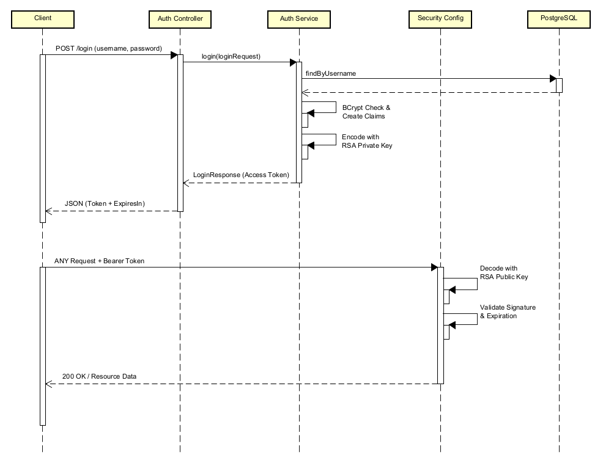

# Carteira de Investimentos

API REST para gerenciamento de uma carteira de investimentos, permitindo cadastro, consulta, atualização, exclusão e cálculo de lucro/prejuízo de ativos como ações e criptomoedas.

## Tecnologias Utilizadas

- Java 17+
- Spring Boot
- Maven
- JPA/Hibernate (SQL)
- Lombok

## Funcionalidades

- Cadastro de investimentos (ações e criptomoedas)
- Consulta de todos os investimentos ou filtrados por tipo
- Atualização de quantidade e preço de compra de ativos
- Cálculo de lucro ou prejuízo na venda de ativos
- Exclusão de investimentos
- Integração com API externa para cotação de ativos

## Endpoints Principais

Todos os endpoints estão sob o path `/investments`.

| Método | Endpoint                 | Descrição                                 |
| ------ | ------------------------ | ----------------------------------------- |
| GET    | /investments/summary     | Resumo dos investimentos                  |
| POST   | /investments             | Cadastrar novo investimento               |
| GET    | /investments             | Listar todos os investimentos             |
| GET    | /investments/type={type} | Listar investimentos por tipo             |
| DELETE | /investments/id={id}     | Excluir investimento por ID               |
| PUT    | /investments             | Atualizar investimento                    |
| PUT    | /investments/sale        | Registrar venda e calcular lucro/prejuízo |


## Estrutura do Projeto

```
carteiraDeinvestimentos/
├── src/
│   ├── main/
│   │   ├── java/br/edu/ufop/web/carteira/investimentos/carteiraDeinvestimentos/
│   │   │   ├── controller/        # Controllers REST (endpoints)
│   │   │   ├── converter/         # Conversores de dados
│   │   │   ├── domain/            # Lógica de negócio
│   │   │   ├── dtos/              # Data Transfer Objects
│   │   │   ├── enums/             # Enumerações de tipos
│   │   │   ├── exception/         # Tratamento de exceções
│   │   │   ├── models/            # Modelos de entidades
│   │   │   ├── repositories/      # Interfaces de persistência
│   │   │   ├── service/           # Serviços de negócio
│   │   │   └── CarteiraDeinvestimentosApplication.java # Classe principal
│   │   └── resources/
│   │       ├── application.properties # Configurações
│   │       ├── static/               # Arquivos estáticos
│   │       └── templates/            # Templates para views
│   └── test/
│       └── java/br/edu/ufop/web/carteira/investimentos/carteiraDeinvestimentos/
│           └── CarteiraDeinvestimentosApplicationTests.java # Testes automatizados
├── pom.xml
├── mvnw / mvnw.cmd
└── docker-compose-dev.yaml
```

## Como Executar

1. Clone o repositório:
   ```bash
   git clone https://github.com/diasbruno00/TP3-web2.git
   ```
2. Acesse a pasta do projeto:
   ```bash
   cd carteiraDeinvestimentos
   ```
3. Configure o banco de dados em `src/main/resources/application.properties`.
4. Compile o projeto:
   ```bash
   mvn clean install
   ```
5. Execute a aplicação:
   ```bash
   mvn spring-boot:run
   ```

## Testes

Para rodar os testes automatizados:

```bash
mvn test
```

## Docker

Para executar o projeto com Docker Compose:

```bash
docker-compose -f docker-compose-dev.yaml up
```

## Autor

Bruno Dias

## Link youtube apresentação
https://youtu.be/9SEiv0_d5YM?si=T1ONTxrrVIEUXIA9

---

# Evolução do Projeto: Segurança & Arquitetura Stateless

Minha contribuição focou em transformar uma aplicação funcional em um ecossistema **multi-usuário seguro**. Saí do modelo de acesso livre para uma arquitetura **Stateless baseada em OAuth2 e JWT**. Isso significa que a aplicação não "guarda" o usuário em uma sessão no servidor, em vez disso, ela valida cada requisição de forma independente e segura.

### Arquitetura de Segurança (RSA JWT)

Utilizei criptografia **RSA (Chave Pública/Privada)** para garantir a integridade dos dados:
- O backend atua como emissor de tokens. Quando você faz login, o sistema valida suas credenciais e assina um **JWT** usando uma **Chave Privada**.
- Os endpoints de investimentos são blindados. Para acessar, o cliente deve enviar o token, que é validado pelo backend usando uma **Chave Pública**.

### Este diagrama ilustra exatamente como a segurança funciona na prática:



### Tecnologias de Segurança Utilizadas
- **Spring Security 6**: Configuração de filtros e proteção de endpoints.
- **Nimbus JWT**: Biblioteca robusta para codificação e decodificação de tokens.
- **BCrypt**: Para hashing de senhas no banco de dados (nunca salvamos senhas em texto puro!).
- **RSA 2048 bits**: Chaves assimétricas para assinatura dos tokens.


### Contribuição de:

João Henrique da Silva Guimarães (https://github.com/jhguimaraess)
